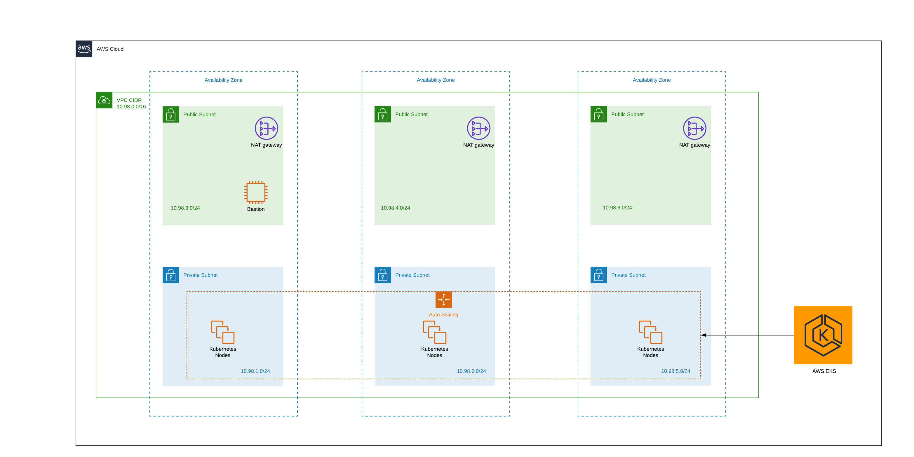
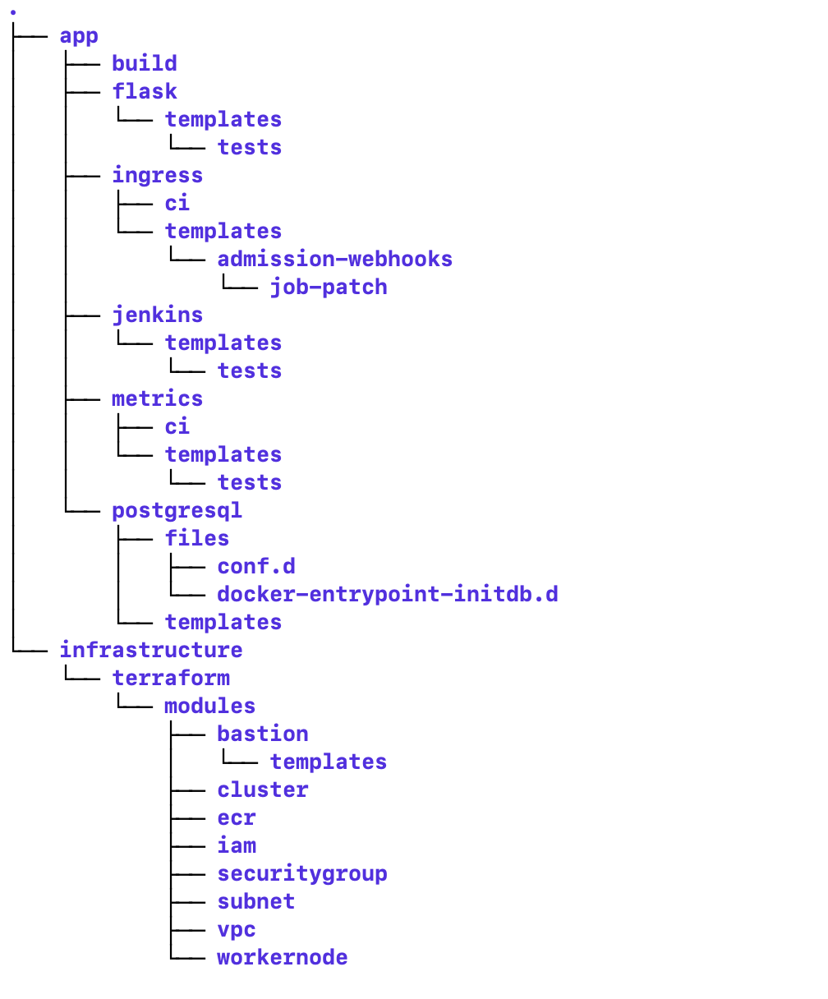

# Devops Implementation

This code Repo has the code and instructions to achieve the Development Environment deployment at ease.

## Tech stack

-   Cloud - AWS
-   Container Platform - Docker
-   Infrastructure provisioning - Terraform
-   Kubernetes platform - EKS
-   Kubernetes application Deployment - Helm
-   CI/CD - Jenkins
-   Back end - Flask
-   Database - Postgres
-   Other tools like Lucid Chart for arch diagram and Stack Edit for the ReadMe file

## Architecture Diagram



## Project Structure


## Prerequisites

_Note: Text with  `command`  highlighting to be considered as commands to be executed._

In order to get the solution up running, we need to install AWS CLI and GIT command line tools to interact with AWS through API's and git repositories respectively.

Please use following links to install for specific OS required installations.

-   [AWS CLI Installation](https://docs.aws.amazon.com/cli/latest/userguide/cli-chap-install.html), Configure the CLI with AWS Credentials using  `aws configure`  command and verify the installation using the command  `aws sts get-caller-identity`  command.
-   [GIT Installation](https://git-scm.com/downloads), Verify installation by issuing  `git`  command.

## Working with code

Follow the steps as mentioned below.

1.  `git clone https://github.com/nagarajujalpal/revolut-tech-assignment.git`
2.  `aws s3api create-bucket --bucket <unique-bucketname> --region <region>`
3.  Verify the bucket creation step using  `aws s3 ls --region <previously used region name>`, in the output verify if  _unique-bucketname_  exists.
4.  Update the s3 bucket name in [backend.tf](https://github.com/nagarajujalpal/revolut-tech-assignment/tree/master/infrastructure/terraform) file
5.  Create a  [EC2 Key Pair](https://docs.aws.amazon.com/AWSEC2/latest/UserGuide/ec2-key-pairs.html)  and copy the downloaded KeyPair to [module/bastion](https://github.com/nagarajujalpal/revolut-tech-assignment/tree/master/infrastructure/terraform/modules/bastion)
6.  Modify the keypair name in file  [terraform/var.tf](https://github.com/nagarajujalpal/revolut-tech-assignment/blob/master/infrastructure/terraform/vars.tf)
7. Install [Terraform](https://docs.aws.amazon.com/AWSEC2/latest/UserGuide/ec2-key-pairs.html)  on your laptop

## Setting up the Infrastructure [from local workstation]

Use following commands to setup infrastructure for the first time.
  
- Change working directory using`cd infrastructure/terraform`
-   `terraform init`
-   `terraform validate`
-   `terraform plan -out plan.tf`
-   `terraform apply`

## Working with Infrastructure & App [from Bastion Host]

- After successful execution, login to bastion host by copying IP from the terraform output using previously created KeyPair
- On the bastion host tools like AWS CLI, HELM, GIT are installed to interact with EKS cluster using CLI,  
- Configure AWS CLI on bastion host with same IAM user credentials used to provision the infrastructure.


_Security Check: If you have not mentioned your ssh access ip range in the bastion then by default bastion host is open to public and configuring aws cli with the admin privileges and bastion open to public is bad practice. The reason behind configuring aws cli with the admin privileges on the bastion is for joining the worker nodes into EKS we need the same user credentials who has provisioned the cluster. For providing access to the cluster for developer we can follow the link [EKS Access](https://docs.aws.amazon.com/eks/latest/userguide/add-user-role.html)._

Execute the following commands on the bastion host to get the configuration done.

-   `mkdir .kube && mv config .kube/`
-   `kubectl apply -f configmap.yaml`
-   `git clone https://github.com/nagarajujalpal/revolut-assignment.git`
-   Change to app folder,  `cd revolut-assignment/app`
-   First we will install the Metrics and the Jenkins 
-   `helm install metrics metrics`
-   `helm install jenkins jenkins`

To obtain the Jenkins server url, issue  `kubectl get svc`  [Might take sometime to provision all pods].

Access the Jenkins URL and follow this on screen instructions and setup environment for the first use.

### List of plugins installed during Jenkins master start

- kubernetes:1.25.1

- workflow-job:2.36

- workflow-aggregator:2.6

- credentials-binding:1.21

- git:4.2.0

- amazon-ecr:1.6

- ansicolor:0.6.3

- aws-global-configuration:1.3

- build-with-parameters:1.557

- docker-custom-build-environment:1.625.3

- github-pr-comment-build:1.625.1

After configuring the plugins, we need to create pipeline job using the Jenkinsfile

Configure the webhook to the newly created Jenkins url

## Testing

-   Commit a change to the git which is configured above.
    
    The commit will trigger the job to build the docker image and tag it as flask:latest.
    
-   Push to ecr with tag as flask:latest
    
-   CD job will be triggered after latest image push and does the following as part of the job.
    
    ```
      helm install ingress ingress
      helm install postgresql postgresql
      helm install flask flask
    ```
    

It will take some time for all the pods to be up and running

Get the ingress svc endpoint using  `kubectl get svc`  and access it using the postman (http://<endpointurl>/hello/username)

## Additional Information

To verify the Horizontal Pod Autoscaler functionality, Execute the below load-generator which will spike-up the CPU utilisation and HPA scales up the application.

#Create deployment for the load-generator in interactive mode
`kubectl run -i --tty load-generator --image=busybox /bin/sh`

#One-line script to spike the cpu utilization of application
`while true; do wget -q -O- http://[endpointurl]/hello/healthCheck; done`

## Decommissioning

After successful verification, we can destroy all the resources provisioned as part of the testing.

For destroying follow mentioned steps below.

#On Bastion Host
#Uninstall the helm charts from the EKS Cluster
`helm uninstall ingress jenkins postgresql flask metrics`

Once this is executed, make sure all the services and deployments are killed and exit from bastion host. Later, proceed with the terraform destroy using the below commands from the terminal [local workstation].

#On your workstation
#destroy the aws resource created using the terraform
`terraform destroy --auto-approve`

These steps can be repeated any number of times.
